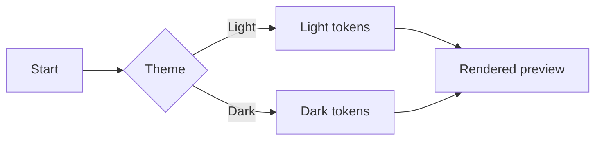
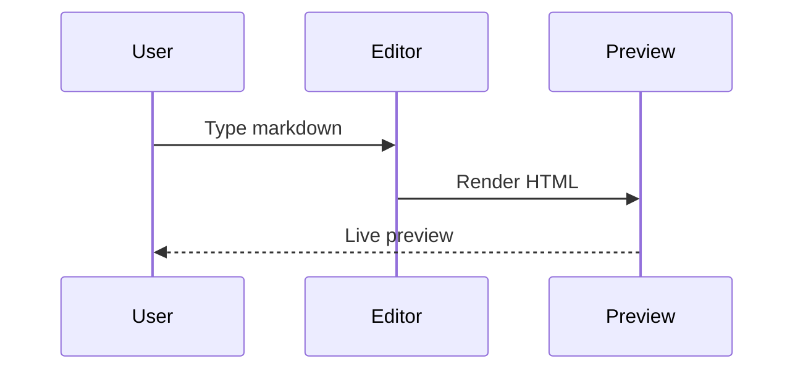

# 🧪 Poe Markdown Render Manual Test

Use this document to quickly verify that Markdown rendering, syntax highlighting, Mermaid, tables, and theme behavior all look correct.

## Manual Test Checklist

- Load this file in Poe editor and confirm editor + preview stay in sync while scrolling.
- Toggle between light and dark theme and confirm readability/contrast remains good for all sections.
- Confirm first heading text updates page title and emoji favicon (`🧪`).
- Export as HTML in light mode, open file, confirm light styling.
- Export as HTML in dark mode, open file, confirm dark styling.
- Copy preview as rich text and paste into a rich-text target (e.g., docs editor) to verify structure survives.
- Copy editor markdown and confirm pasted text matches source.

---

## 1) Headings

# H1 Example

## H2 Example

### H3 Example

#### H4 Example

##### H5 Example

###### H6 Example

## 2) Paragraphs, Emphasis, Typography

This paragraph tests **bold**, _italic_, **_bold italic_**, ~~strikethrough~~, and `inline code`.

Typographer checks: "double quotes", 'single quotes', three dots..., double-hyphen -- and em-dash style text.

Long wrapping paragraph check: Lorem ipsum dolor sit amet, consectetur adipiscing elit, sed do eiusmod tempor incididunt ut labore et dolore magna aliqua. Ut enim ad minim veniam, quis nostrud exercitation ullamco laboris nisi ut aliquip ex ea commodo consequat.

## 3) Links, Autolinks, Images

- Standard link: [Poe Editor Repository](https://github.com/)
- Autolink text (should become clickable): https://example.com/path?q=poe-editor
- Mail autolink: test@example.com

Image check:


## 4) Lists

Unordered list:

- Item A
- Item B
  - Nested B.1
  - Nested B.2
- Item C

Ordered list:

1. First
2. Second
3. Third

Mixed content list:

1. Step one with `code`.
2. Step two with **formatting**.
3. Step three with a sub-list:
   - Sub step A
   - Sub step B

## 5) Blockquotes and Rules

> Blockquote level 1
>
> > Blockquote level 2
>
> Back to level 1 with **bold text** and a [link](https://example.org).

---

## 6) Tables (Including CJK/Emoji Width)

| Column      | Value          | Notes                    |
| ----------- | -------------- | ------------------------ |
| Plain ASCII | abc123         | Baseline width           |
| CJK         | 漢字かなカナ   | Wide-character alignment |
| Emoji       | 😀🚀✅         | Emoji width handling     |
| Mixed       | テスト test ✅ | Mixed width content      |

Alignment table:

| Left | Center | Right |
| :--- | :----: | ----: |
| L1   |   C1   |    R1 |
| L2   |   C2   |    R2 |

## 7) Inline HTML Should Be Escaped (Renderer Safety)

The following should render as text, not active HTML:

<div style="color: red;">This should not be interpreted as live HTML.</div>

And script tags should not execute:

<script>window.__POE_MD_TEST__ = 'should-not-run'</script>

## 8) Code Blocks (Language Labels + Highlighting)

No language fence (should render code block without language header):

```
plain code block
with multiple lines
and no syntax language
```

JavaScript:

```javascript
const message = 'Hello, Poe'
function greet(name) {
  return `${message}, ${name}!`
}
console.log(greet('Markdown'))
```

TypeScript:

```typescript
type User = { id: number; name: string }
const users: User[] = [{ id: 1, name: 'Poe' }]
```

JSON:

```json
{
  "app": "poe-editor",
  "features": ["markdown", "mermaid", "transformers"],
  "darkMode": true
}
```

YAML:

```yaml
name: poe-editor
theme: dark
modules:
  - markdown
  - mermaid
```

SQL:

```sql
SELECT id, name
FROM users
WHERE active = TRUE
ORDER BY created_at DESC;
```

Shell:

```bash
npm run dev
npm test
npm run build
```

Unknown language (header should still be humanized):

```custom-lang_name
render this with a generated language label
```

## 9) Mermaid Diagrams

Flowchart:



Sequence diagram:



## 10) Markdown in Quotes and Escapes

Escaped symbols: \*literal asterisks\*, \_literal underscore\_, \`literal backticks\`.

Inline code with markdown syntax inside: `**not bold inside inline code**`.

## 11) Large Section for Scroll Sync

Paragraph 1: The quick brown fox jumps over the lazy dog.

Paragraph 2: The quick brown fox jumps over the lazy dog.

Paragraph 3: The quick brown fox jumps over the lazy dog.

Paragraph 4: The quick brown fox jumps over the lazy dog.

Paragraph 5: The quick brown fox jumps over the lazy dog.

Paragraph 6: The quick brown fox jumps over the lazy dog.

Paragraph 7: The quick brown fox jumps over the lazy dog.

Paragraph 8: The quick brown fox jumps over the lazy dog.

Paragraph 9: The quick brown fox jumps over the lazy dog.

Paragraph 10: The quick brown fox jumps over the lazy dog.

Paragraph 11: The quick brown fox jumps over the lazy dog.

Paragraph 12: The quick brown fox jumps over the lazy dog.

Paragraph 13: The quick brown fox jumps over the lazy dog.

Paragraph 14: The quick brown fox jumps over the lazy dog.

Paragraph 15: The quick brown fox jumps over the lazy dog.

## 12) Final Render Sanity

If everything is working, you should see:

- Correct typography and spacing across all markdown elements.
- Syntax-highlighted code with language headers (except no-language block).
- Mermaid diagrams rendered (not raw mermaid code) in preview.
- Clean table borders/alignment in both themes.
- Inline HTML displayed as literal text for safety.
