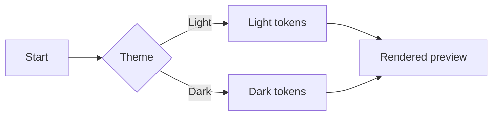
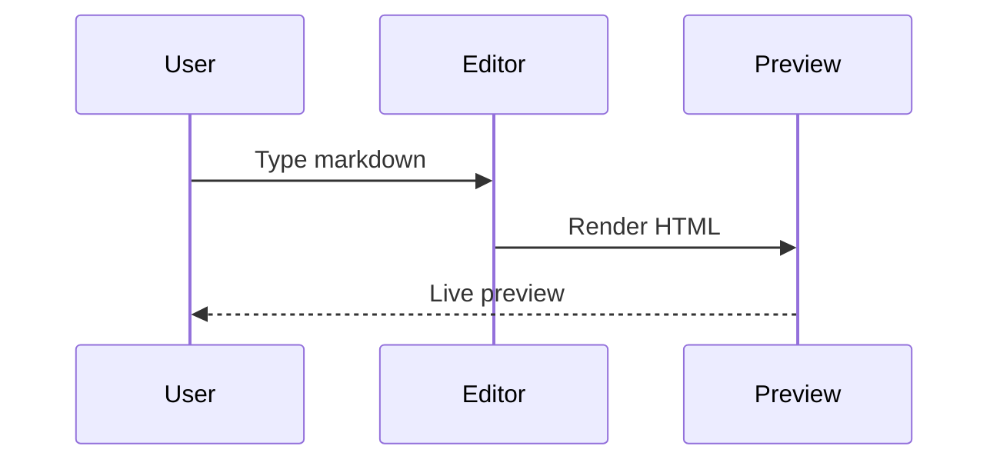

# 🧪 Poe Markdown Render Manual Test

Use this document to quickly verify that Markdown rendering, syntax highlighting, Mermaid, tables, and theme behavior all look correct.

## Manual Test Checklist

- Load this file in Poe editor and confirm editor + preview stay in sync while scrolling.
- Confirm front matter renders as a properties panel above the first heading and raw YAML delimiters are hidden.
- Toggle between light and dark theme and confirm readability/contrast remains good for all sections.
- Confirm first heading text still updates page title and emoji favicon (`🧪`) instead of front matter.
- Export as HTML in light mode, open file, confirm light styling.
- Export as HTML in dark mode, open file, confirm dark styling.
- Copy preview as rich text and paste into a rich-text target (e.g., docs editor) to verify structure survives.
- Copy editor markdown and confirm pasted text matches source.
- Verify GitHub callouts (`NOTE`, `TIP`, `IMPORTANT`, `WARNING`, `CAUTION`) render with alert styling.
- Verify GitHub-safe HTML tags render correctly and unsafe HTML is sanitized.
- Verify task list checkboxes render in preview, can be clicked, and update markdown source markers.
- Verify autolink literals render for bare URLs/emails, but not inside inline/fenced code.
- Verify footnote references link to a grouped footnote section with backreferences.

---

## 1) Headings

# H1 Example

## H2 Example

### H3 Example

#### H4 Example

##### H5 Example

###### H6 Example

## 2) Paragraphs, Emphasis, Typography

This paragraph tests **bold**, _italic_, **_bold italic_**, ~~strikethrough~~, and `inline code`.

Typographer checks: "double quotes", 'single quotes', three dots..., double-hyphen -- and em-dash style text.

Long wrapping paragraph check: Lorem ipsum dolor sit amet, consectetur adipiscing elit, sed do eiusmod tempor incididunt ut labore et dolore magna aliqua. Ut enim ad minim veniam, quis nostrud exercitation ullamco laboris nisi ut aliquip ex ea commodo consequat.

## 3) Links, Autolinks, Images

- Standard link: [Poe Editor Repository](https://github.com/)
- Autolink text (should become clickable): https://example.com/path?q=poe-editor
- Autolink text with `www` prefix: www.example.com/docs
- Mail autolink: test@example.com
- Inline code should not autolink: `https://example.com test@example.com www.example.com`

Image check:


## 4) Lists

Unordered list:

- Item A
- Item B
  - Nested B.1
  - Nested B.2
- Item C

Ordered list:

1. First
2. Second
3. Third

Mixed content list:

1. Step one with `code`.
2. Step two with **formatting**.
3. Step three with a sub-list:
   - Sub step A
   - Sub step B

Task list:

- [ ] Plan release notes
- [x] Merge dependency upgrades
- [ ] Validate print output
  - [x] Verify headings and tables
  - [ ] Verify task list checkboxes

## 5) Blockquotes and Rules

> Blockquote level 1
>
> > Blockquote level 2
>
> Back to level 1 with **bold text** and a [link](https://example.org).

---

## 6) GitHub Callouts (Alerts)

> [!NOTE]
> Useful information that users should know, even when skimming.

> [!TIP]
> Practical advice for completing a task more efficiently.

> [!IMPORTANT]
> Key details that can affect correctness or compatibility.

> [!WARNING]
> Risks that could cause incorrect results or data loss.

> [!CAUTION]
> Negative consequences to avoid during setup or editing.

## 7) Tables (Including CJK/Emoji Width)

| Column      | Value          | Notes                    |
| ----------- | -------------- | ------------------------ |
| Plain ASCII | abc123         | Baseline width           |
| CJK         | 漢字かなカナ   | Wide-character alignment |
| Emoji       | 😀🚀✅         | Emoji width handling     |
| Mixed       | テスト test ✅ | Mixed width content      |

Alignment table:

| Left | Center | Right |
| :--- | :----: | ----: |
| L1   |   C1   |    R1 |
| L2   |   C2   |    R2 |

## 8) GitHub-Safe HTML (Sanitized Rendering)

These common GitHub-safe tags should render:

<details>
<summary>Click to expand safe HTML sample</summary>

<div align="center">
<kbd>Ctrl</kbd> + <kbd>K</kbd><br>
<sup>2</sup> and H<sub>2</sub>O
</div>

<table>
  <thead>
    <tr><th align="left">Tag</th><th align="left">Expected</th></tr>
  </thead>
  <tbody>
    <tr><td><code>&lt;mark&gt;</code></td><td><mark>highlight text</mark></td></tr>
    <tr><td><code>&lt;ins&gt;</code></td><td><ins>inserted text</ins></td></tr>
    <tr><td><code>&lt;del&gt;</code></td><td><del>deleted text</del></td></tr>
  </tbody>
</table>


</details>

Unsafe content should be sanitized:

<script>window.__POE_MD_TEST__ = 'should-not-run'</script>

<a href="javascript:alert('xss')">Unsafe javascript link</a>


## 9) Code Blocks (Language Labels + Highlighting)

No language fence (should render code block without language header):

```
plain code block
with multiple lines
and no syntax language
```

JavaScript:

```javascript
const message = 'Hello, Poe'
function greet(name) {
  return `${message}, ${name}!`
}
console.log(greet('Markdown'))
```

TypeScript:

```typescript
type User = { id: number; name: string }
const users: User[] = [{ id: 1, name: 'Poe' }]
```

JSON:

```json
{
  "app": "poe-editor",
  "features": ["markdown", "mermaid", "transformers"],
  "darkMode": true
}
```

YAML:

```yaml
name: poe-editor
theme: dark
modules:
  - markdown
  - mermaid
```

SQL:

```sql
SELECT id, name
FROM users
WHERE active = TRUE
ORDER BY created_at DESC;
```

Shell:

```bash
npm run dev
npm test
npm run build
```

Unknown language (header should still be humanized):

```custom-lang_name
render this with a generated language label
```

## 10) Mermaid Diagrams

Flowchart:



Sequence diagram:



## 11) Markdown in Quotes and Escapes

Escaped symbols: \*literal asterisks\*, \_literal underscore\_, \`literal backticks\`.

Inline code with markdown syntax inside: `**not bold inside inline code**`.

Emoji shortcode rendering checks:

- Should convert in normal text: :smile: :heart: :+1:
- Escaped shortcode should stay literal: \:smile:
- Inline code shortcode should stay literal: `:smile:`

Fenced code shortcode should stay literal:

```text
:smile:
```

## 12) Footnotes (GitHub-style)

Footnote references should render as superscript links: one note[^footnote-one], another note[^footnote-two], and a repeated reference[^footnote-one].

[^footnote-one]: First footnote definition paragraph.

    Continued paragraph inside the same footnote definition to verify multi-paragraph rendering.

[^footnote-two]: Second footnote definition with a [link](https://example.com).

## 13) Large Section for Scroll Sync

Paragraph 1: The quick brown fox jumps over the lazy dog.

Paragraph 2: The quick brown fox jumps over the lazy dog.

Paragraph 3: The quick brown fox jumps over the lazy dog.

Paragraph 4: The quick brown fox jumps over the lazy dog.

Paragraph 5: The quick brown fox jumps over the lazy dog.

Paragraph 6: The quick brown fox jumps over the lazy dog.

Paragraph 7: The quick brown fox jumps over the lazy dog.

Paragraph 8: The quick brown fox jumps over the lazy dog.

Paragraph 9: The quick brown fox jumps over the lazy dog.

Paragraph 10: The quick brown fox jumps over the lazy dog.

Paragraph 11: The quick brown fox jumps over the lazy dog.

Paragraph 12: The quick brown fox jumps over the lazy dog.

Paragraph 13: The quick brown fox jumps over the lazy dog.

Paragraph 14: The quick brown fox jumps over the lazy dog.

Paragraph 15: The quick brown fox jumps over the lazy dog.

## 14) Final Render Sanity

If everything is working, you should see:

- Correct typography and spacing across all markdown elements.
- Syntax-highlighted code with language headers (except no-language block).
- Mermaid diagrams rendered (not raw mermaid code) in preview.
- Clean table borders/alignment in both themes.
- GitHub-safe HTML renders; disallowed tags/attributes are stripped.

## 14) Extended Markdown

### TOC directive

<!-- TOC -->

### TOC Level 3 Child

#### TOC Level 4 Child

### TOC Level 3 Sibling

Superscript example: 19^th^ century

Subscript example: H~2~O and CO~2~.

Highlight example: ==this text is highlighted==.

Definition list examples:

Term One
: Single definition line

Term Two
: First definition
: Second definition

Term Three
: First paragraph in definition

Second paragraph continuation for the same definition.

Code fence edge-cases (should remain literal and **not** render as extensions):

```markdown
<!-- TOC -->

19^th^
H~2~O
==not highlighted==
Term In Code
: Not a definition list
```
